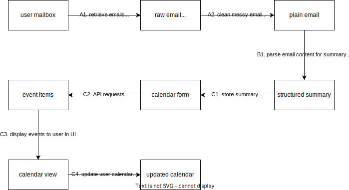
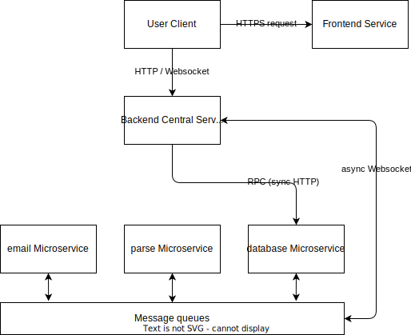

# Email Wizard

A wizard who structures all your emails for you.

## Description

Codes in this repo should be able to parse raw email contents into structured contents, including email title, sender, content summary, and important dates. Optionally, it may be able to pull emails from modern mail boxes (such as outlook, gmail, 126/163.com, etc.), store parsed results in a calendar format and present them to users.

## Design

### Workflow



### Architecture



## Tasks

### Stage 1

#### A1. retrieve emails

- [x] use IMAP/POP3 protocol to retrieve emails from various mailboxes
  - [x] support 126/163.com mailboxes (with IMAP)
  - [x] support outlook mailboxes

#### A2. clean email into plain texts

- [x] retrieve raw email contents from retrieved emails
- [x] transform raw email contents into plain text
  - [x] discard image (for now)
  - [x] extract and keep plain text content
  - [x] extract email subject, sender, date and time
- [x] deploy with microservice (together with A1)
  - [x] benchmark microservice performance

#### B1. parse plain text for summary and dates

- [x] construct prompts for ChatGPT/GPT
  - [x] build a small dataset of emails and the structured summary
  - [ ] explore different models and different prompts
    - [x] set up evaluation metrics
    - [x] concurrent ChatGPT requests
- [x] use OpenAI API or other models to get structured summary
  - [x] obtain model output from prompts
  - [x] parse model output into structured summary
- [ ] migrate to langchain?
- [x] deploy with microservice
  - [x] benchmark microservice performance

#### C1. store summary to database

- [ ] design API protocol
  - [ ] CRUD operations interface
- [ ] Implement APIs
  - [ ] database design
    - [ ] choose database engine
    - [ ] design database schema
  - [ ] create (C) records for users and emails
  - [ ] read (R) records of users, emails, and parsed events
  - [ ] update (U) records of users, emails, and parsed events
  - [ ] delete (D) records of users, emails, and parsed events
- [ ] deploy as a microservice
  - [ ] benchmark microservice performance

#### C2. API requests

- [x] backend API interface design
  - [x] refresh events, query events, and more
- [x] handle requests by interacting with microservices
  - [x] choose microservice framework
  - [x] implement logic with prepared microservices
    - [x] retrieve emails from user mailboxes
    - [x] extract new emails
    - [x] parse to events
    - [x] store results to database
    - [x] query database for results
- [x] deploy with microservice

#### C3. calendar view UI

- [ ] frontend UI design and development
  - [x] UI wireframe
  - [ ] build UI with React
    - [x] implement main calendar page (use fake user_id and secret for now)
    - [ ] implement add email account
    - [ ] implement login page (get user_id and secret)
    - [ ] implement logout page
- [ ] deploy to production server

### Stage 2

#### A1. retrieve emails

- [ ] support gmail mailboxes
- [ ] optimize QPS

#### A2. clean email into plain texts

- [ ] handle html content

#### B1. parse plain text for summary and dates

- [ ] improve throughput with asynchronous service (possibly through message queues)
- [ ] refine API interface
- [ ] optimize QPS

#### C1. store summary to database

- [ ] refine API interface

#### C2. API requests

- [ ] refine API interface

#### C3. calendar view UI

- [ ] refine API interface

#### C4. update calendar

- [ ] add/remove events in user calendar based on user actions
  - [ ] find libraries to access user calendar (possibly outlook calendar)
  - [ ] add links to user calendar in UI

## Environments

### Benchmarking

Use `ghz` with Docker for benchmarking gRPC microservice performance:

```bash
DOCKER_BUILDKIT=1 sudo docker build --output=/usr/local/bin --target=ghz-binary-built https://github.com/bojand/ghz.git
```
